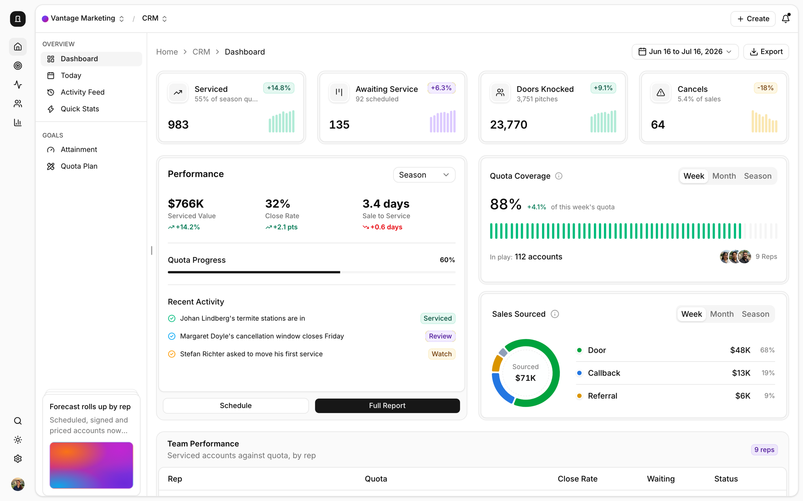
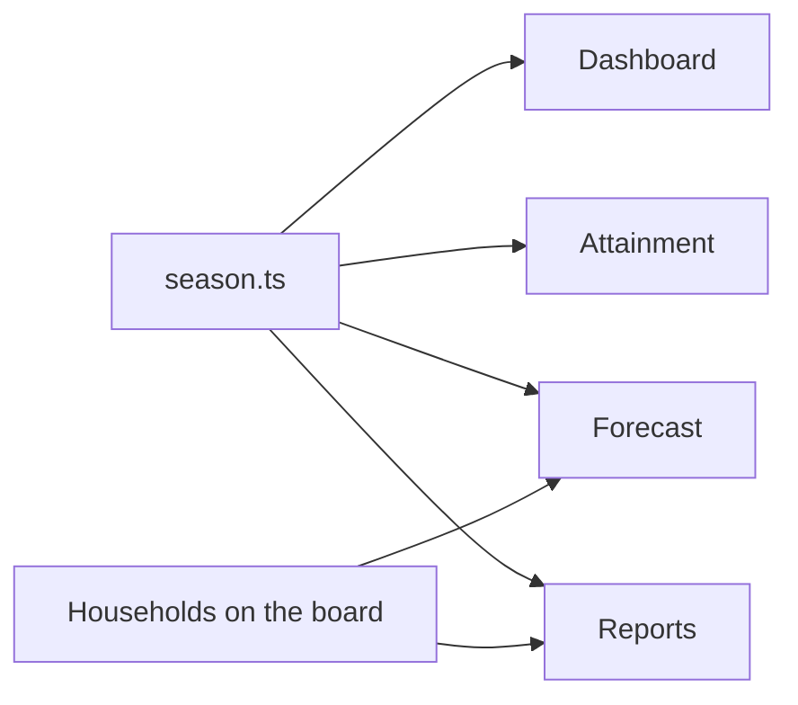

# Knock

A CRM for door-to-door sales: the pipeline, forecast, quotes, approvals, reps' activity, homeowners, territories and
reports, set up for a summer pest control team.

**Demo:** [knock-crm-demo.vercel.app](https://knock-crm-demo.vercel.app) (one tap signs you in as Tessa, the regional
director)



I set it up the way these companies actually run. The demo company is **Vantage Marketing** out of Provo, selling
pest control agreements for a partner. It has three offices (Boise, Raleigh, Phoenix) and a 16-week season, and it's
week 11. A sale doesn't count until it's serviced: the homeowner has three days to cancel, then it gets scheduled,
then serviced, and that's what pays the rep.

> Vantage is a real company, but this has nothing to do with them. The partner, the people, the households and every
> number are made up.

## What's in it

| App        | Screens                                                                                   |
| ---------- | ----------------------------------------------------------------------------------------- |
| Home       | Dashboard, Today, Activity Feed, Quick Stats, Attainment, Quota Plan                      |
| Sales      | Pipeline board (drag cards and columns), Forecast, Quotes, New Quote, Products, Approvals |
| Activities | Activity timeline, Tasks                                                                  |
| Homeowners | Homeowners, each homeowner's page, Territories                                            |
| Reports    | Overview, Conversion                                                                      |
| Settings   | General, Billing, Team, Integrations, plus your Profile, Preferences and Notifications    |

The buttons actually do things: filters filter, new records show up in their lists, quotes send, approvals decide,
and CSVs export and import. ⌘K searches everything, **D** flips light and dark, and it works on a phone.

## How it works



- **One source for the numbers.** Every screen reads from one file of season numbers (each rep's doors, pitches,
  sales and services), and the tests check that they all agree: 1,182 sold, 983 serviced, $765,703 serviced value.
- **Real plans and pay.** Five pest plans priced as a first service plus a recurring charge, reps paid every two
  weeks with a back-end check at the end of summer. The full setup is in [docs/world.md](docs/world.md).
- **Nothing a visitor does gets saved.** Postgres only holds sign-in; the sales data lives in the browser.

## Stack

| Layer   | What I used                                                     |
| ------- | --------------------------------------------------------------- |
| App     | Next.js 16 (App Router, React Compiler), React 19, TypeScript 7 |
| UI      | Tailwind 4, shadcn/ui on Base UI, Recharts, dnd-kit             |
| Data    | Postgres and Drizzle for sign-in, typed data for the season     |
| Auth    | Better Auth                                                     |
| Testing | Vitest, Playwright with axe, Oxlint, Knip                       |
| Hosting | Vercel and Neon                                                 |

## Running it

You need Node 24, pnpm 10 and Postgres ([Postgres.app](https://postgresapp.com) on a Mac).

```bash
pnpm bootstrap   # installs, makes .env.local and the database, migrates
pnpm dev         # http://localhost:3002
```

| Command         | What it does                                              |
| --------------- | --------------------------------------------------------- |
| `pnpm check`    | Types, lint, formatting, unused code and unit tests       |
| `pnpm test:e2e` | Every page on desktop and phone with accessibility checks |

Deploying is in [docs/deployment.md](docs/deployment.md).

## Security and accessibility

Sign-in is Better Auth with hashed passwords, database sessions and no sign-up. The demo account gets created the
first time someone signs in.

Every page passes axe in light and dark on desktop and phone, and anything you can drag you can also do from a menu.
