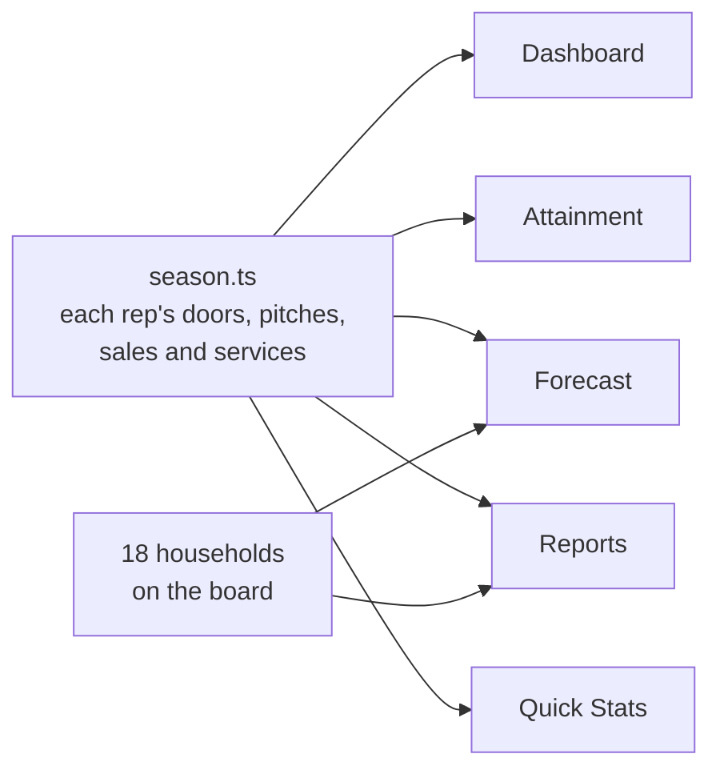

# Knock

A CRM for door-to-door sales. Pipeline, forecast, quotes, approvals, reps' activity, homeowners, territories and
reports, set up for a summer pest control team.

**Demo:** [knock-crm-demo.vercel.app](https://knock-crm-demo.vercel.app) (one tap signs you in as Tessa, the regional
director)


I set it up the way these companies actually run. The demo is
**Vantage Marketing** out of Provo, selling pest control agreements for a partner company. Three offices (Boise,
Raleigh, Phoenix), a 16-week season, and it's week 11. A sale doesn't count until the partner services it: the
homeowner has three days to cancel, then it gets scheduled, then serviced, and that's what pays the rep.

> Vantage is a real company but this has nothing to do with them. The partner, the people, the households and all
> the numbers are made up, and the portraits are generated.

## What's in it

| App        | Screens                                                                                   |
| ---------- | ----------------------------------------------------------------------------------------- |
| Home       | Dashboard, Today, Activity Feed, Quick Stats, Attainment, Quota Plan                      |
| Sales      | Pipeline board (drag cards and columns), Forecast, Quotes, New Quote, Products, Approvals |
| Activities | Activity timeline, Tasks                                                                  |
| Homeowners | Homeowners, each homeowner's page, Territories                                            |
| Reports    | Overview, Conversion                                                                      |
| Settings   | General, Billing, Team, Integrations, plus your Profile, Preferences and Notifications    |

The buttons actually do things: filters filter, new records show up in their lists, quotes send, approvals decide,
and CSVs export and import. ⌘K searches everything, **D** flips light and dark, and it works on a phone.

## How the numbers work



Everything reads from one file of season numbers, and the tests make sure every screen agrees (1,182 sold, 983
serviced, $765,703 in serviced value).

| Plan               | Price              | First year |
| ------------------ | ------------------ | ---------- |
| Quarterly Pest     | $149 then $119 × 4 | $625       |
| Bi-Monthly Pest    | $99 then $79 × 6   | $573       |
| Mosquito Season    | $69 × 6            | $414       |
| Termite Monitoring | $795 then $45 × 12 | $1,335     |
| Rodent Exclusion   | $449 then $35 × 12 | $869       |

The full setup (offices, reps, how pay works) is in [docs/world.md](docs/world.md).

## Stack

| Layer   | What I used                                                          |
| ------- | -------------------------------------------------------------------- |
| App     | Next.js 16 (App Router, React Compiler), React 19, TypeScript 7      |
| UI      | Tailwind 4, shadcn/ui on Base UI, Recharts, dnd-kit                  |
| Data    | Postgres and Drizzle for sign-in; the sales data is typed in the app |
| Auth    | Better Auth                                                          |
| Testing | Vitest, Playwright with axe, Oxlint, Knip                            |
| Hosting | Vercel and Neon                                                      |

## Running it

You need Node 24, pnpm 10 and Postgres ([Postgres.app](https://postgresapp.com) on a Mac).

```bash
pnpm bootstrap   # installs, makes .env.local and the database, migrates
pnpm dev         # http://localhost:3002
```

| Command         | What it does                                              |
| --------------- | --------------------------------------------------------- |
| `pnpm check`    | Types, lint, formatting, unused code and unit tests       |
| `pnpm test:e2e` | Every page on desktop and phone with accessibility checks |

Deploying is Vercel plus Neon; the steps are in [docs/deployment.md](docs/deployment.md).

## Security and accessibility

Sign-in is Better Auth with hashed passwords, database sessions and no sign-up. The demo account gets created the
first time someone signs in. Everything else lives in the browser, so nothing a visitor does gets saved.

Every page passes axe in light and dark on desktop and phone, and anything you can drag you can also do from a menu.
